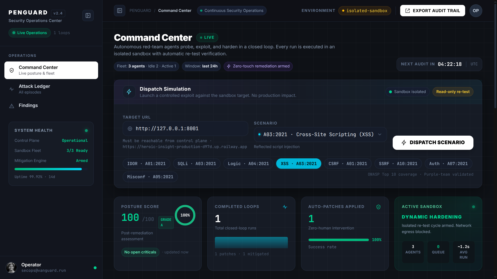
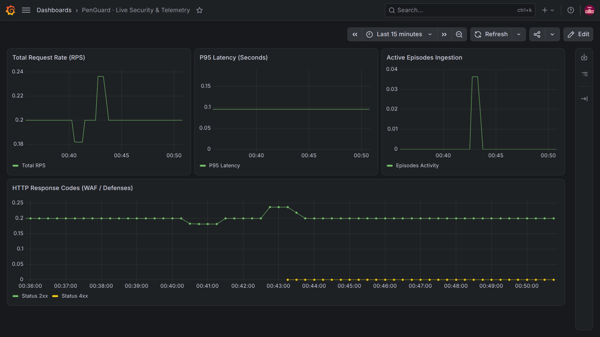
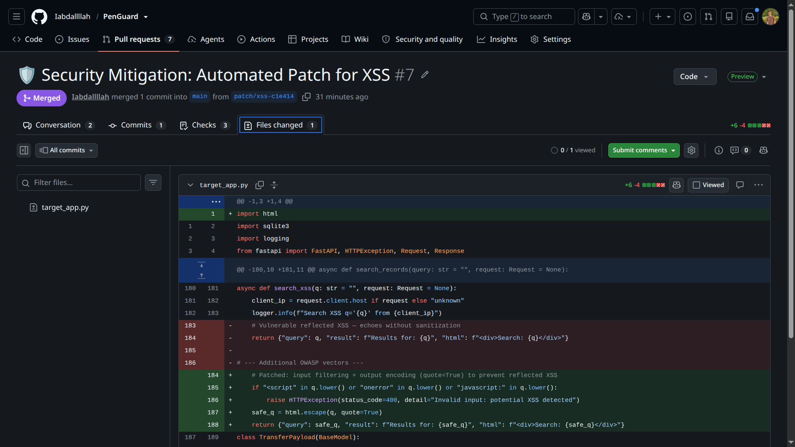

# PenGuard: Autonomous Purple Team Platform

[](https://github.com/Iabdallllah/PenGuard/actions)
[](https://python.org)
[](https://fastapi.tiangolo.com)
[](https://nextjs.org)
[](docs/proposal.md)
[](https://sarifweb.azurewebsites.net)
[](https://heroic-insight-production-d97d.up.railway.app/api/health)
[](https://penguardai.vercel.app/)
[](https://vercel.com)
[](https://railway.app)
[](https://prometheus.io)
[](LICENSE)

> **Live Demo:** Frontend → **[https://penguardai.vercel.app/](https://penguardai.vercel.app/)** · API → **[https://heroic-insight-production-d97d.up.railway.app/api/health](https://heroic-insight-production-d97d.up.railway.app/api/health)** · Grafana → `http://localhost:3001` (admin/admin) · Mobile Spec → `docs/mobile-app.md`

PenGuard (formerly Purple Web) is an enterprise-grade, **closed-loop DevSecOps** platform. **Red Agent → Blue Agent → GitHub PR → Sandbox Re-test → Verified Patch** — all autonomous, no human in the loop. Built on **LangGraph + Groq + Neo4j-ready Graph-RAG + PostgreSQL + WebSockets**.

```text
                [User: base_url + scenario]
                         │
                         ▼
              ┌──────────────────────┐
              │   VANGUARD Dashboard │  (Next.js, WebSocket /ws/episodes)
              └──────────┬───────────┘
                         │ POST /api/episodes/run
                         ▼
              ┌──────────────────────┐      ┌─────────────────────┐
              │  Red Agent (Recon)   │─────►│   Blue Agent (Fix)  │
              │  Auto-Crawl + Exploit│      │  AST-safe Patch     │
              └──────────┬───────────┘      └──────────┬──────────┘
                         │                             │ create_git_ref
                         └──────────────┬──────────────┘
                                        ▼
                               ┌──────────────────┐
                               │  GitHub PR       │──► Sandbox Re-test ──► Verdict Comment
                               └──────────────────┘        │
                                                           ▼
                                                    ┌─────────────┐
                                                    │  CI Green   │
                                                    └─────────────┘
```

---

## Core Capabilities

- **Autonomous Closed-Loop Hardening:** Reconnaissance -> Exploit -> Telemetry Detection -> Dynamic Patching -> Retest Verification.
- **Multi-Agent Orchestration:** Powered by LangGraph and Groq LLM inference, separating concerns into dedicated adversarial and defensive agents.
- **Dynamic Container Sandboxing:** Ephemeral container isolation utilizing Docker Engine to prevent test bleed and state contamination.
- **Continuous Compliance Engine:** Automated mapping of findings and mitigation evidence directly to OWASP Top 10, SOC 2 Type II, ISO/IEC 27001, and NIST SP 800-53 controls.
- **Episodic Long-Term Memory:** Persistent retrieval-augmented memory backed by ChromaDB to record remediation efficacy and avoid duplicate exploit paths.

---

## System Architecture

```text
               +-------------------------------------------------------------+
               |                  PENGUARD ORCHESTRATOR                      |
               +-------------------------------------------------------------+
                                               |
                                               v
                               +-------------------------------+
                               |  PostgreSQL + ChromaDB Memory |
                               |  (Episodes + Vector Retrieval)|
                               +-------------------------------+
                                               |
                      +------------------------+------------------------+
                      |                                                 |
                      v                                                 v
         +-------------------------+                       +-------------------------+
         |     RED TEAM ENGINE     |                       |    BLUE TEAM ENGINE     |
         +-------------------------+                       +-------------------------+
         |  1. Dynamic Recon       |                       |  3. Telemetry Detection |
         |     (Auto-Crawl + Scan) |                       |     (Log & Leak Triage) |
         |                         |                       |                         |
         |  2. Exploit Formulation |                       |  4. Hardening & Patch   |
         |     (Targeted Payload)  |                       |     (AST-safe Patch)    |
         +-------------------------+                       +-------------------------+
                      |                                                 ^
                      | (Adversarial Traffic)                           | (Policy Injection)
                      v                                                 |
         +---------------------------------------------------------------------------+
         |                          ISOLATED DOCKER SANDBOX                          |
         |              FastAPI Target App (8 Vuln Endpoints) + WAF Gates            |
         +---------------------------------------------------------------------------+
                                               |
                                               v
                               +-------------------------------+
                               |   Automated Retest Cycle      |
                               |   (Confirms 4xx Boundary)     |
                               +-------------------------------+
                                               |
                                               v
                               +-------------------------------+
                               | Compliance & Executive Export |
                               | (SOC 2, ISO 27001, OWASP, PDF)|
                               +-------------------------------+
                                               |
                                               v
                               +-------------------------------+
                               |     Posture Engine (CVSS)     |
                               |  S(t) = max(0, 100 − Σ w·CVSS)|
                               +-------------------------------+
```

---

## Multi-Agent Execution Flow

```text
[Episode Trigger]
       │
       ▼
[Retrieve Memory] ──► Query ChromaDB for historical attack surfaces and patch notes.
       │
       ▼
[Red: Recon]      ──► Analyze target routes, expected schemas, and parameter vulnerabilities.
       │
       ▼
[Red: Exploit]    ──► Formulate structured exploit request (GET/POST payload).
       │
       ▼
[Sandbox Probe]   ──► Execute exploit against ephemeral Docker sandbox.
       │
       ▼
[Blue: Detection] ──► Parse HTTP response status, body leaks, and classify threat flags.
       │
       ▼
[Blue: Hardening] ──► Select mitigation rule and inject dynamic filtering into target runtime.
       │
       ▼
[Retest Step]     ──► Re-execute identical exploit payload to confirm 4xx boundary enforcement.
       │
       ▼
[Posture Scoring] ──► Calculate updated posture score (0-100) and commit episode to ChromaDB.
```

---

## Attack Vectors & Compliance Controls (8 OWASP Vectors)

| Vector | OWASP Tag | Target Surface | CVSS | Initial → Secured | Verification | Framework Controls |
| :--- | :--- | :--- | :---: | :--- | :---: | :--- |
| **Broken Access Control (IDOR)** | A01:2021 | `/api/user/{id}` | 7.5 | 200 → 403 | Re-test 403 + RBAC gate | SOC 2 CC6.1, NIST AC-3 |
| **SQL Injection** | A03:2021 | `/api/records?query=` | 8.6 | 200 → 403 | Re-test 403 + parameterized queries | ISO 27001 A.8.28, NIST SI-4 |
| **Business Logic Abuse** | A04:2021 | `/api/checkout` | 7.4 | 200 → 400 | Re-test 400 + schema invariants | SOC 2 CC7.1, NIST SI-4 |
| **Cross-Site Scripting (XSS)** | A03:2021 | `/api/search?q=` | 6.1 | 200 → 400 | Re-test 400 + GitHub PR + verdict comment | OWASP A03:2021, NIST SI-10 |
| **CSRF** | A01:2021 | `/api/transfer` | 6.5 | 200 → 403 | Re-test 403 + token validation | SOC 2 CC6.1, NIST AC-8 |
| **SSRF** | A10:2021 | `/api/fetch?url=` | 8.5 | 200 → 403 | Re-test 403 + URL allowlist | NIST SC-7, ISO A.13.1 |
| **Broken Authentication** | A07:2021 | `/api/login` | 8.1 | 200 → 401 | Re-test 401 + session enforcement | NIST IA-2, SOC 2 CC6.1 |
| **Security Misconfiguration** | A05:2021 | `/api/debug` | 5.3 | 200 → 403 | Re-test 403 + TLS/HSTS/PQC probe | ISO A.12.5, NIST CM-7 |

---

## Project Structure

```text
PenGuard/
├── api_server.py           # FastAPI: /health /episodes /run(202) /approve /posture /scenarios /reports /metrics /ws/episodes
├── orchestrator.py         # LangGraph 2-Red + 2-Blue + reflection loop + recon + PR hook
├── sandbox_manager.py      # Docker SDK ephemeral sandbox lifecycle (staleness-aware rebuild)
├── memory_manager.py       # ChromaDB vector store (fallback in-memory)
├── remediator.py           # GitHub API PR creator + re-test verdict comments (PyGithub, no clone)
├── database.py             # SQLAlchemy: Episode + PostureMetric (PostgreSQL + SQLite fallback)
├── target_app.py           # 8-vuln target + dynamic WAF gates (block_idor, block_sqli, ...)
├── scripts/legacy/         # Unused standalone scripts (kept out of the import graph)
├── tests/                  # pytest: contract, posture, SARIF, guards (21 tests, no docker needed)
├── sandbox/
│   ├── Dockerfile          # Sandbox image
│   └── requirements.txt    # Sandbox runtime
├── dashboard/              # Next.js VANGUARD SOC UI (Vercel root directory)
│   ├── src/app/page.tsx    # Metrics, inspector, trend, history, Clear, PR button
│   └── package.json
├── docs/
│   ├── architecture.md     # Academic architecture reference
│   ├── references.bib      # Citations (STIX, MITRE, PentestGPT, FIPS 203/204/205)
│   ├── mobile-api.md       # Flutter ↔ API contract (REST + WS + FCM)
│   ├── mobile-app.md       # Flutter app spec (screens, state, acceptance)
│   ├── ui-ux-prd.md        # Unified Web + Mobile PRD
│   └── proposal.md         # Project proposal (+ PQC readiness §4.3)
├── .github/workflows/ci.yml # ruff + pytest + live smoke + dashboard build
├── SECURITY.md             # Disclosure policy, secrets, crypto posture, scope
├── LICENSE                 # MIT (2026)
├── monitoring/             # Local observability stack (not part of Railway/Vercel deploys)
│   ├── docker-compose.monitoring.yml
│   ├── prometheus.yml
│   └── grafana-dashboard.json
├── Dockerfile              # Railway: single-port API + target via start.sh
├── start.sh
├── railway.json
├── nixpacks.toml
├── requirements.txt        # Production deps (Railway)
└── requirements-dev.txt    # pytest + ruff + httpx (CI/local only)
```

---

## Installation & Setup

### Prerequisites
- Linux OS (Ubuntu 22.04+ recommended)
- Python 3.11+
- Docker Engine & Docker Daemon running
- Node.js 18+ and npm
- Groq Cloud API Key

### 1. Environment Setup

```bash
git clone https://github.com/Iabdallllah/PenGuard.git
cd PenGuard

python3 -m venv venv
source venv/bin/activate
pip install -r requirements.txt
```

Set your Groq API Key:
```bash
export GROQ_API_KEY="your-groq-api-key-here"
```

### 2. Pre-build Target Sandbox Image

```bash
docker build --network=host -t purple-target:latest -f sandbox/Dockerfile .
```

### 3. Start Backend + Target (Offline Fallback - One Command Each)

```bash
# Terminal 1: Target (vulnerable app)
uvicorn target_app:app --host 127.0.0.1 --port 8001 --reload

# Terminal 2: API + Orchestrator (with live metrics)
uvicorn api_server:app --host 127.0.0.1 --port 8000 --reload
# Metrics: http://127.0.0.1:8000/metrics  &  http://127.0.0.1:8000/api/metrics

# Terminal 3: Monitoring (optional, for Grafana demo)
docker compose -f monitoring/docker-compose.monitoring.yml up -d
# Prometheus: http://localhost:9090/targets → 1/1 UP
# Grafana: http://localhost:3001 → admin/admin → Import monitoring/grafana-dashboard.json
```

### 4. Start Telemetry Dashboard

In a separate terminal:
```bash
cd dashboard
npm install
npm run dev
```

Open `http://localhost:3000` in your browser. For production, set `NEXT_PUBLIC_API_BASE=https://heroic-insight-production-d97d.up.railway.app`.

**Offline Demo Fallback (for viva without internet):**
- The two `uvicorn` commands above are sufficient — no Docker or external API needed (fallback mock works without `GROQ_API_KEY`).
- Pre-save screenshots in `docs/screenshots/` (Grafana + Dashboard + PR) to show in slides if network is blocked.

### 5. Run Checks (lint + tests)

```bash
pip install -r requirements-dev.txt
ruff check api_server.py orchestrator.py sandbox_manager.py database.py remediator.py memory_manager.py target_app.py tests/
python -m pytest tests/ -q
```

---

## Screenshots

| Dashboard (Vercel) | Observability (Grafana) | Autonomous PR (GitHub) |
| :---: | :---: | :---: |
|  |  |  |

---

## API Reference

- `GET /api/health` — liveness probe (open)
- `GET /api/episodes` — list all episodes (PostgreSQL + JSON fallback, open)
- `GET /api/episodes/{id}` — episode detail (open)
- `POST /api/episodes/run` — dispatch `{"scenario": "idor"|...|"misconfig", "target_url": ""}` → `202 {status: QUEUED, episode_id}` immediately, execution in background, completion via WS — **requires `X-API-Key`** (single-flight: second dispatch while QUEUED/RUNNING → `409`)
- `POST /api/episodes/{id}/approve` — approve attached GitHub PR as official review — **requires `X-API-Key`** (`409` if no PR / still running, `503` if GitHub unconfigured)
- `DELETE /api/episodes` — clear history — **requires `X-API-Key`**
- `GET /api/scenarios` — list 8 vectors with CVSS/severity/CWE/weight (open)
- `GET /api/posture` — `{"score": n, "status": "HEALTHY|DEGRADED|CRITICAL", "active_vulnerabilities": n, "mitigated_vulnerabilities": n, "last_audit_timestamp": "..."}` (open)
- `GET /api/reports/compliance` — dynamic binary PDF from live ledger (open)
- `GET /api/reports/sarif` — SARIF 2.1.0 export (8 rules + threat findings) for GitHub code scanning / Snyk / SonarQube (open)
- `POST /api/reports/seal` — freeze an immutable SHA-256 snapshot of the ledger — **requires `X-API-Key`**
- `GET /api/reports/verify/{hash}` — public tamper check returning the sealed snapshot (open)
- `GET /.well-known/security.txt` — RFC 9116 disclosure + trust posture (open)
- Episodes carry `inference_metrics` (per-node latency always; tokens/cost only with live LLM + configured rates) and `explainability` (confidence + source + rule + rationale)
- `GET /metrics` & `GET /api/metrics` — Prometheus exposition (open)
- `WS /ws/episodes` — real-time episode streaming (array on connect, then per-episode frames; 30s ping)

B2B loop: bounded self-reflection (failed retests retry hardening, max 3 attempts, logged per episode) → sandbox re-test verdict auto-commented on the real PR → Discord/Slack webhook alert per completed episode (`PENGUARD_WEBHOOK_URL`).

Selective auth: only `POST /run`, `POST /approve`, and `DELETE /episodes` require `X-API-Key`; all `GET` routes + WS are open.

---

## Posture Engine (Continuous Risk Quantification)

Each vector carries a CVSS 4.0 base score and a business weight. The real-time posture score is:

```
S(t) = max(0, 100 − Σ_{unpatched} weight_i · CVSS_i)
```

| Vector | CVSS | Weight | CWE |
| :--- | :---: | :---: | :--- |
| SQL Injection | 8.6 | 1.0 | CWE-89 |
| SSRF | 8.5 | 1.0 | CWE-918 |
| Broken Auth | 8.1 | 0.9 | CWE-287 |
| IDOR | 7.5 | 0.9 | CWE-639 |
| Business Logic | 7.4 | 0.8 | CWE-840 |
| CSRF | 6.5 | 0.7 | CWE-352 |
| XSS | 6.1 | 0.6 | CWE-79 |
| Misconfig | 5.3 | 0.5 | CWE-16 |

Status bands: `≥80 HEALTHY` · `50–79 DEGRADED` · `<50 CRITICAL`. Exposed via `GET /api/posture` and Prometheus gauge `penguard_posture_score`.

---

## Mobile Companion (Flutter)

Operator app spec: `docs/mobile-app.md` · API contract: `docs/mobile-api.md` · Shared PRD: `docs/ui-ux-prd.md`.

Features: Posture gauge, 8-vector dispatcher (with API key), live episode feed (WS + polling fallback), episode detail with PR button, PDF export, FCM critical alerts. `X-API-Key` injected via `--dart-define` or secure storage.

---

## License
MIT License. Built for advanced cybersecurity and autonomous agent research.# PenGuard
